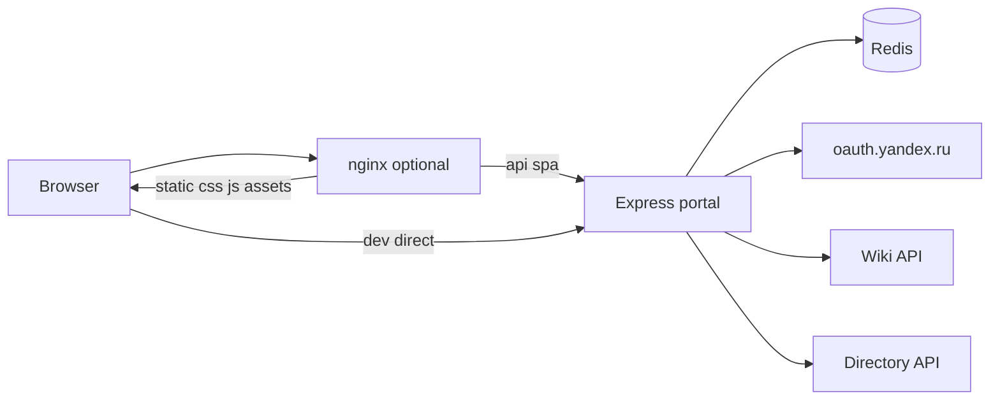

# Архитектура

Корпоративный ИТ-портал 21vek: статический фронтенд (HTML + vanilla JS + CSS) и Node.js backend (Express) для OAuth, Wiki proxy и Tracker demo.

## Общая схема



**Production (single):** nginx → один процесс Node на `:3000`.

**Production (scale):** nginx отдаёт `/css`, `/js`, `/assets`, `/errors` с диска; `/api`, `/`, `/wiki` проксирует на 3 реплики Node; Redis хранит сессии и Wiki-кэш. См. [SCALE.md](SCALE.md).

---

## Backend

**Точка входа:** [`backend/src/index.js`](../backend/src/index.js)

### Middleware (порядок)

1. `validateSecurityConfig()` — блокирует небезопасный prod-запуск
2. Session — только для `/api/*` ([`session.js`](../backend/src/session.js), `needsSession()`)
3. `compression` — gzip от 1 KB
4. Versioned cache — `?v=` на bundles/wiki JS → `immutable` 1 год
5. `helmet` — CSP, HSTS (prod), CORP, referrerPolicy, Permissions-Policy
6. `express.json` — лимит 100 KB
7. Request ID + sampled HTTP logging
8. API routers + static + SPA fallback

### Маршруты API

| Prefix | Файл | Endpoints |
|--------|------|-----------|
| inline | `index.js` | `GET /api/health`, `GET /api/health/details` (auth) |
| `/api/auth` | [`routes/auth.js`](../backend/src/routes/auth.js) | login, callback, me, logout, config-check |
| `/api/wiki` | [`routes/wiki.js`](../backend/src/routes/wiki.js) | config-check (public), tree, page, search, asset, auth-check, audit |
| `/api/tracker` | [`routes/tracker.js`](../backend/src/routes/tracker.js) | POST issues, password-reset |

### Middleware-модули

| Модуль | Назначение |
|--------|------------|
| [`requireAuth.js`](../backend/src/middleware/requireAuth.js) | Проверка сессии; guest types для части заявок |
| [`csrf.js`](../backend/src/middleware/csrf.js) | Origin/Referer на mutating POST |
| [`rateLimit.js`](../backend/src/middleware/rateLimit.js) | Лимиты auth, wiki, tracker, health; scale mode |
| [`wikiCache.js`](../backend/src/middleware/wikiCache.js) | Memory (2000 entries) + Redis (`portal:wiki:`), dedup |

### Auth и сессии

| Модуль | Роль |
|--------|------|
| [`yandex.js`](../backend/src/auth/yandex.js) | OAuth authorize, token exchange, profile |
| [`yandex360.js`](../backend/src/auth/yandex360.js) | Directory: должность/отдел; defer на `/api/auth/me` |
| [`sessionOAuth.js`](../backend/src/auth/sessionOAuth.js) | Минимизация OAuth token в session |
| [`domain.js`](../backend/src/auth/domain.js) | Gate `@21vek.by` |

**Cookie:** `portal.sid`, `httpOnly`, `secure` (prod), `sameSite: lax`, rolling, max age из `SESSION_MAX_AGE_DAYS`.

**Store:** `memory` (dev) или `redis` (`portal:sess:` prefix). Scale mode требует Redis.

### Wiki pipeline

```
GET /api/wiki/page
  → scope guard (wikiScope.js)
  → cache lookup (memory/redis)
  → Yandex Wiki API (yandexWiki.js)
  → @diplodoc/transform (timeout + max input)
  → sanitize-html + rewrite links/assets
  → cache store → JSON { html, title, ... }
```

- **Scope:** только `YANDEX_WIKI_BASE_SLUG` и потомки
- **Assets:** `/api/wiki/asset` с per-user cache keys (`asset:v2:{authHash}:…`)
- **Service token:** `YANDEX_WIKI_OAUTH_TOKEN` для shared cache при scale

### Tracker (demo)

[`tracker/validate.js`](../backend/src/tracker/validate.js) валидирует payload. При `TRACKER_DEMO_MODE=true` возвращает `DEMO-{timestamp}` без вызова Yandex Tracker API. Prod API — в [ROADMAP.md](ROADMAP.md).

### Статика и SPA

- `/data/*` — всегда 404 (snapshot не публичен)
- `express.static(projectRoot)` — HTML `no-store`, assets `max-age=3600`
- `/` → `index.html`, `/wiki/*` → `wiki.html`
- Несуществующие assets → plain 404; прочие пути → `errors/404.html`

Конфигурация: [`backend/src/config.js`](../backend/src/config.js), шаблон [`backend/.env.example`](../backend/.env.example).

---

## Frontend

Статический сайт без JS-бundler. Модули экспортируют globals на `window`.

### Страницы

| HTML | URL | Назначение |
|------|-----|------------|
| [`index.html`](../index.html) | `/` | Карточки услуг, поиск, модалки, auth gate |
| [`wiki.html`](../wiki.html) | `/wiki/*` | Встроенный Wiki reader |
| [`errors/*.html`](../errors/) | — | 400–504 (сборка `build:errors`) |

### Порядок скриптов

**`<head>`:** `portal-search-hotkey.js`, `portal-theme-init.js`, `portal.bundle.css`

**Главная (конец body):**
```
config.js → config.local.js → auth/errors.js → auth/* → modal → form → tracker →
theme → nav → search-index-loader → search → cards → request-types →
app/wiki-links → app/hr-wizard → app → request-stats → tour/*
```

**Wiki (`wiki.html`):**
```
config.js → config.local.js → auth/errors.js → auth/* → theme → wiki/api → wiki/tour → wiki/reader
```

### Ключевые globals

| Global | Файл | Назначение |
|--------|------|------------|
| `PortalConfig` | `js/config.js` + local | Конфиг среды |
| `PortalAuth` | `js/auth/*` | OAuth gate, login/logout |
| `PortalTracker` | `js/tracker.js` | POST `/api/tracker/*` |
| `PortalSearchIndex` | `js/search-index.js` | Индекс поиска (build) |
| `PortalWikiApi` | `js/wiki/api.js` | Клиент `/api/wiki/*` |

### События

| Событие | Когда |
|---------|-------|
| `portal:auth-ready` | Сессия проверена |
| `portal:task-submitted` | Заявка отправлена |
| `portal:theme-changed` | Смена темы |
| `portal:filter-changed` | Поиск отфильтровал карточки |

### CSRF

Mutating endpoints (`POST /api/auth/logout`, `POST /api/tracker/*`) проверяют `Origin`/`Referer` против `PUBLIC_URL`. Wiki — только GET. Same-origin SPA + `SameSite=Lax` cookie.

---

## Data layer

| Файл | Источник | Назначение |
|------|----------|------------|
| `data/request-types.json` | Ручной | Типы заявок, поля форм |
| `data/search.overrides.json` | Ручной | Синонимы поиска |
| `data/wiki-search.json` | `sync-wiki-index.mjs` | Подсказки Wiki в поиске |
| `js/search-index.js` | `build-search-index.mjs` | `window.PortalSearchIndex` |
| `css/*.bundle.css` | `build-css-bundle.mjs` | Сжатые CSS |
| `errors/*.html` | `build-error-pages.mjs` | Страницы ошибок |

Generated artifacts **коммитятся** для zero-build Docker deploy. См. [DEVELOPMENT.md](DEVELOPMENT.md).

---

## Build pipeline

```bash
npm run build
# = build:search + build:errors + build:css
```

Wiki sync (отдельно):
```bash
npm run refresh:wiki-search   # sync + build + validate
```

---

## Docker overlays

| Файл | Назначение |
|------|------------|
| `docker-compose.yml` | Базовый сервис `portal` |
| `docker-compose.prod.yml` | Hardening, Redis default, wiki volume |
| `docker-compose.scale.yml` | Redis + nginx + scale env |

Подробнее: [DEPLOY.md](DEPLOY.md), [SCALE.md](SCALE.md).

---

## Связанные документы

- [DEVELOPMENT.md](DEVELOPMENT.md) — локальная разработка
- [guides/AUTH-SETUP.md](guides/AUTH-SETUP.md) — OAuth
- [guides/WIKI-SETUP.md](guides/WIKI-SETUP.md) — Wiki
- [SECURITY.md](SECURITY.md) — модель безопасности
- [ROADMAP.md](ROADMAP.md) — дальнейшая работа
