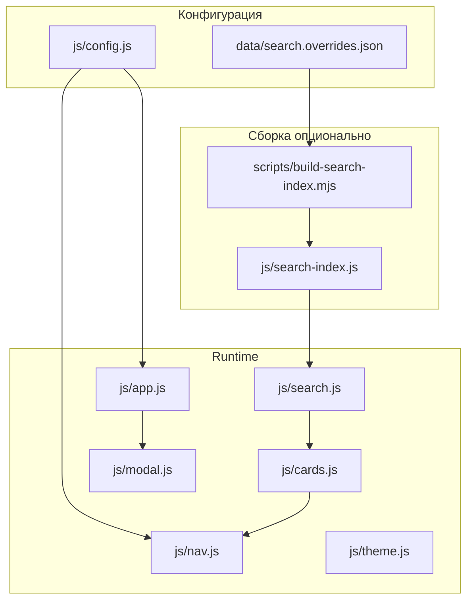
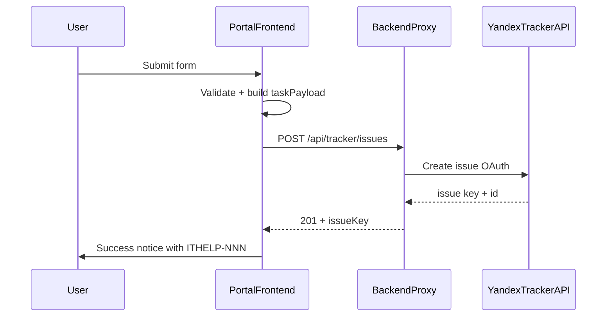

# План доработок ИТ-портала 21vek

Дополнительный документ к [README.md](../README.md). Описывает текущее состояние проекта, выявленные риски и рекомендуемые улучшения.

**Документ не заменяет README** — он служит чек-листом для команды ИТ и основой для планирования интеграции с Яндекс Трекером.

---

## Принципы отбора рекомендаций

- Без глобальной перестройки архитектуры (остаёмся на статическом сайте, vanilla JS, config-driven модели).
- Приоритет **стабильности** и **универсальности** (браузеры, устройства, доступность, сопровождаемость).
- Инкрементальные изменения: каждая рекомендация решает конкретную проблему, а не переписывает проект.

### Легенда приоритетов

| Приоритет | Значение |
|-----------|----------|
| **P0** | Блокер или критический риск стабильности — исправить до prod / до подключения Трекера |
| **P1** | Важно для сопровождаемости, UX или интеграции |
| **P2** | Улучшение качества, снижение технического долга |
| **P3** | Полировка, не блокирует работу |

### Методология анализа

Проведён code review статического портала: HTML, CSS, JavaScript, конфигурация, сборочные скрипты. Нагрузочное тестирование, pen-test и аудит инфраструктуры **не проводились** — соответствующие пункты вынесены в backlog при необходимости.

---

## Текущее состояние проекта

Портал — **статический SPA-подобный сайт** без npm-сборки фронтенда: [index.html](../index.html) + модули в [js/](../js/) + CSS по слоям в [css/](../css/).



### Порядок загрузки скриптов

```
config.js → modal.js → form.js → theme.js → nav.js → search-index.js → search.js → cards.js → app.js
```

Ранний init темы: `js/portal-theme-init.js` в `<head>` (см. ARCH-01).

### Сильные стороны

- **Разделение ответственности**: конфиг (`PortalConfig`), поиск, модалки, тема, навигация — отдельные модули.
- **Умный поиск**: синонимы, переключение раскладки RU/EN, overrides через [data/search.overrides.json](../data/search.overrides.json).
- **Модальные окна**: focus trap, Escape, восстановление фокуса, `aria-*` ([js/modal.js](../js/modal.js)).
- **Адаптивность**: safe-area insets, touch targets 44px, `prefers-reduced-motion`.
- **Демо-режим Трекера**: payload формируется корректно, отправка имитируется без секретов в репозитории.

### Критические находки

| # | Проблема | Риск |
|---|----------|------|
| 1 | Отсутствует [js/portal-theme-init.js](../js/portal-theme-init.js) — подключён в `index.html` и `errors/*.html`, но файла нет в репозитории | 404 в консоли, возможная вспышка темы (FOUC) при загрузке |
| 2 | **Три источника правды** для услуг: карточки в HTML, `requestMap` в [js/app.js](../js/app.js), сгенерированный [js/search-index.js](../js/search-index.js) | Рассинхронизация при добавлении/изменении услуг |
| 3 | Интеграция Трекера — **заглушка**: `demoMode: true`, только `console.log`; при `demoMode: false` модалка закрывается **без HTTP-запроса** | Prod-режим не работает; пользователь думает, что заявка отправлена |
| 4 | README описывает **боковое меню**; sidebar удалён из разметки, но orphan CSS остался в [css/nav.css](../css/nav.css) и [css/style.css](../css/style.css) | Путаница при сопровождении, мёртвый CSS |
| 5 | Карточки услуг — `<div>` без клавиатурной активации | Недоступны для keyboard-only пользователей и части AT |

---

## 2. Архитектура и сопровождаемость

### ARCH-01 · P0 · Отсутствующий portal-theme-init.js

**Проблема.** В [index.html](../index.html) (строка 9) и всех `errors/*.html` подключён `js/portal-theme-init.js`, но файл отсутствует в репозитории.

**Риск.** 404 при каждой загрузке страницы; тема применяется поздно через [js/theme.js](../js/theme.js), возможна вспышка светлой темы при сохранённой тёмной.

**Предложение.** Создать минимальный `portal-theme-init.js`, который синхронно читает `localStorage` (ключ из `PortalConfig.themeStorageKey` или hardcoded `portal-theme`) и выставляет `document.documentElement.dataset.theme` до отрисовки. Альтернатива: inline `<script>` в `<head>` без отдельного файла.

**Файлы:** `js/portal-theme-init.js` (создать), `index.html`, `errors/*.html`.

---

### ARCH-02 · P1 · Контракт добавления новой услуги

**Проблема.** Новая услуга требует правок в нескольких местах без формализованного чек-листа.

**Риск.** Карточка видна на экране, но форма не открывается (нет `requestMap`) или не находится в поиске (нет индекса/overrides).

**Предложение.** Зафиксировать чек-лист в README или в этом документе:

1. Добавить `.service-card` в [index.html](../index.html) с `data-request-type`, `data-section`, заголовком и описанием.
2. Добавить запись в `requestMap` в [js/app.js](../js/app.js) (title, options, defaultOpt).
3. При необходимости — ключевые слова в [data/search.overrides.json](../data/search.overrides.json).
4. Пересобрать индекс: `node scripts/build-search-index.mjs`.
5. Проверить: клик → форма, поиск по названию и синонимам.

**Файлы:** `index.html`, `js/app.js`, `data/search.overrides.json`, `js/search-index.js`.

---

### ARCH-03 · P1 · Валидация сборки search-index

**Проблема.** [scripts/build-search-index.mjs](../scripts/build-search-index.mjs) парсит HTML и `requestMap` через regex; при изменении формата сборка может молча пропустить карточки.

**Риск.** Поиск не находит новые услуги; расхождение HTML и индекса остаётся незамеченным.

**Предложение.** После сборки сравнивать:
- количество `.service-card[data-request-type]` в HTML vs записей в `cards` индекса;
- каждый `data-request-type` из HTML присутствует в `requestMap`.

При несовпадении — `process.exit(1)` с понятным сообщением.

**Файлы:** `scripts/build-search-index.mjs`.

---

### ARCH-04 · P2 · Единый источник requestMap

**Проблема.** `requestMap` захардкожен в `app.js` и дублируется при сборке индекса через regex-парсинг.

**Риск.** Дублирование и хрупкий парсинг.

**Предложение.** Вынести типы заявок в `data/request-types.json`; `app.js` и `build-search-index.mjs` читают один файл. Runtime-модель (глобальные `Portal*`, без bundler) **не меняется** — только источник данных.

**Файлы:** `data/request-types.json` (создать), `js/app.js`, `scripts/build-search-index.mjs`.

---

### ARCH-05 · P2 · npm-скрипты для CI

**Проблема.** Сборка search-index и error pages — ручные команды Node.

**Риск.** Забытая пересборка в CI/CD; drift между контентом и индексом.

**Предложение.** Минимальный `package.json` только со скриптами:

```json
{
  "scripts": {
    "build:search": "node scripts/build-search-index.mjs",
    "build:errors": "node scripts/build-error-pages.mjs"
  }
}
```

Без npm-зависимостей. Опционально — шаг в pipeline перед деплоем.

**Файлы:** `package.json` (создать).

---

### ARCH-06 · P3 · Документация глобальных контрактов

**Проблема.** Модули общаются через `window.PortalConfig`, `PortalModal`, `PortalForm`, `PortalSearch`, `PortalSearchIndex` без формальной спецификации.

**Риск.** При добавлении разработчиков — ошибки порядка загрузки или несовместимые изменения API.

**Предложение.** Добавить в README или отдельный `docs/ARCHITECTURE.md` таблицу: глобал → методы/поля → кто потребляет.

**Файлы:** `docs/ARCHITECTURE.md` или раздел README.

---

### Out of scope (не рекомендуется)

Следующие изменения **намеренно не предлагаются** — они противоречат принципу стабильности и универсальности без необходимости:

- Переход на React, Vue, Angular или другой SPA-фреймворк.
- Webpack, Vite, esbuild и прочие bundler'ы для основного runtime.
- SSR, микросервисный фронтенд, монорепозиторий.

---

## 3. UI/UX и дизайн-система

### UX-01 · P0 · Карточки услуг как интерактивные элементы

**Проблема.** `.service-card` — `<div>` с обработчиком `click` в [js/app.js](../js/app.js). CSS содержит `.service-card:focus-visible`, но элементы не фокусируемы.

**Риск.** Keyboard-only пользователи и screen reader не могут активировать карточки.

**Предложение.** Заменить на `<button type="button">` с `aria-label` из заголовка карточки или добавить `tabindex="0"`, `role="button"` и обработку Enter/Space. Сохранить текущие классы и внешний вид.

**Файлы:** `index.html`, `js/app.js`, `css/cards.css`.

---

### UX-02 · P1 · Skip-link

**Проблема.** Нет ссылки «Перейти к содержимому» — клавиатурный пользователь проходит через utility links шапки.

**Риск.** Лишние Tab-нажатия; ухудшение UX для AT.

**Предложение.** Добавить скрытую до фокуса ссылку `<a href="#section-support">` в начало `<body>`.

**Файлы:** `index.html`, `css/style.css`.

---

### UX-03 · P1 · Orphan CSS sidebar и README

**Проблема.** Боковое меню удалено из разметки (commit: «Replace the desktop sidebar with top navigation»), но стили `.sidebar-nav*` остались в [css/nav.css](../css/nav.css) и [css/style.css](../css/style.css). README (раздел «Навигация») всё ещё упоминает sidebar.

**Риск.** Путаница при доработках; мёртвый CSS увеличивает размер и когнитивную нагрузку.

**Предложение.** Удалить orphan CSS; обновить README — описать только chip-навигацию под шапкой.

**Файлы:** `css/nav.css`, `css/style.css`, `README.md`.

---

### UX-04 · P1 · Дублирование CSS-правил

**Проблема.** Классы `.search-empty-state` и `.hidden` определены и в [css/style.css](../css/style.css), и в [css/cards.css](../css/cards.css) / [css/modal.css](../css/modal.css) с частично разными свойствами.

**Рisk.** Непредсказуемый cascade при изменении порядка подключения stylesheet'ов.

**Предложение.** Оставить одно определение каждого utility-класса в `style.css` или вынести в `css/utilities.css`.

**Файлы:** `css/style.css`, `css/cards.css`, `css/modal.css`.

---

### UX-05 · P2 · Inline-индикатор поиска

**Проблема.** `#searchThinking` — full-screen overlay на время debounce (110 ms + анимации).

**Риск.** Визуально тяжело; пользователь теряет контекст страницы.

**Предложение.** Маленький spinner внутри `.search-field` или pulsing border у input.

**Файлы:** `index.html`, `css/cards.css`, `js/cards.js`.

---

### UX-06 · P2 · Подсказка Ctrl+F

**Проблема.** Горячая клавиша Ctrl/Cmd+F перехватывается inline-скриптом в [index.html](../index.html), но пользователю об этом не сообщается.

**Риск.** Неожиданное поведение для power users; низкая discoverability для остальных.

**Предложение.** Placeholder «Поиск… (Ctrl+F)» на desktop или hint под полем поиска.

**Файлы:** `index.html`, `css/style.css`.

---

### UX-07 · P2 · Scroll-to-top на мобильных

**Проблема.** Кнопка `#scrollToTop` скрыта до viewport ≥1280px ([css/nav.css](../css/nav.css)).

**Риск.** На телефонах после длинного списка или фильтрации нет быстрого возврата наверх.

**Предложение.** Показывать компактную FAB-кнопку на всех breakpoints или с ≥1024px.

**Файлы:** `css/nav.css`, `js/nav.js`.

---

### UX-08 · P2 · Обрезка текста карточек

**Проблема.** На desktop у `.service-card` заданы `max-height: 360px` и `overflow: hidden` ([css/cards.css](../css/cards.css)).

**Риск.** Длинные заголовки/описания обрезаются; при zoom браузера проблема усиливается.

**Предложение.** Убрать жёсткий max-height или заменить на `min-height` с `overflow: visible`.

**Файлы:** `css/cards.css`.

---

### UX-09 · P2 · Placeholder-разделы FAQ и Регламенты

**Проблема.** FAQ и Регламенты — `<span aria-disabled="true">`, выглядят как ссылки, но не кликабельны.

**Риск.** Ощущение «сломанной ссылки».

**Предложение.** `<button type="button" disabled>` с `title="Раздел в разработке"` или badge «скоро».

**Файлы:** `index.html`, `css/style.css`.

---

### UX-10 · P3 · SVG вместо emoji

**Проблема.** Иконки разделов, карточек и переключателя темы — emoji. Рендеринг различается по ОС; screen reader читает emoji непредсказуемо.

**Предложение.** Постепенно заменить на SVG (декоративные с `aria-hidden="true"`). [assets/logo-21vek.svg](../assets/logo-21vek.svg) уже есть — подключить в шапку.

**Файлы:** `index.html`, `assets/`, `css/style.css`, `js/config.js`.

---

### UX-11 · P3 · Design tokens

**Проблема.** Цвета и радиусы — в CSS variables ([css/variables.css](../css/variables.css)), но spacing и typography — ad hoc rem-значения.

**Предложение.** Добавить `--space-1`…`--space-8`, `--text-sm`/`--text-base`/`--text-lg` без изменения визуала.

**Файлы:** `css/variables.css`, постепенно остальные CSS.

---

### UX-12 · P3 · Тема по умолчанию — system

**Проблема.** `defaultTheme: 'light'` в [js/config.js](../js/config.js).

**Предложение.** `defaultTheme: 'system'` — первый визит следует `prefers-color-scheme` (логика частично есть в [js/theme.js](../js/theme.js)).

**Файлы:** `js/config.js`.

---

## 4. Доступность (a11y)

### A11Y-01 · P0 · Клавиатурная активация карточек

См. **UX-01**. Блокирует использование портала без мыши.

---

### A11Y-02 · P1 · Кастомные radio в HR-форме

**Проблема.** В `#conditionalFields` для tech_support и hr_new radio скрыты через `opacity: 0; pointer-events: none`.

**Риск.** Невозможность выбора с клавиатуры; нарушение WCAG 2.1 (Keyboard).

**Предложение.** Visually hidden pattern: input остаётся focusable, стилизуется через `:checked + label`.

**Файлы:** `js/app.js`, `css/style.css`.

---

### A11Y-03 · P1 · Scroll-to-top в tab order

**Проблема.** Скрытая кнопка scroll-to-top остаётся в tab order (`opacity: 0`, но без `tabindex="-1"`).

**Предложение.** Toggle `tabindex="-1"` и `aria-hidden="true"` при скрытии.

**Файлы:** `js/nav.js`, `css/nav.css`.

---

### A11Y-04 · P2 · Замена alert()

**Проблема.** При неизвестном `requestKey` вызывается `alert()` в [js/app.js](../js/app.js).

**Риск.** Блокирует UI; плохо для AT и mobile.

**Предложение.** `PortalForm.showError` или toast внутри модалки.

**Файлы:** `js/app.js`.

---

### A11Y-05 · P2 · Fallback для modern CSS

**Проблема.** Активное использование `color-mix()`, `backdrop-filter`, View Transitions API.

**Риск.** Деградация в старых браузерах и forced-colors mode.

**Предложение.** Static rgba fallback в `@supports not (color-mix(...))` блоках.

**Файлы:** `css/variables.css`, `css/themes.css`, `css/modal.css`.

---

## 5. Стабильность и кросс-браузерность

### STAB-01 · P0 · 404 portal-theme-init.js

Дубликат **ARCH-01**. Исправить до любого prod-деплоя.

---

### STAB-02 · P1 · Защита от двойной отправки

**Проблема.** Кнопка «Отправить» не блокируется при submit; повторный клик до закрытия модалки возможен.

**Риск.** Дублирующие заявки в Трекере после интеграции.

**Предложение.** `submitBtn.disabled = true` на время запроса; debounce 2–3 сек.

**Файлы:** `js/app.js`.

---

### STAB-03 · P1 · HTTP-слой для заявок

**Проблема.** Нет `fetch`; prod-путь (`demoMode: false`) закрывает модалку без сетевого вызова.

**Риск.** Потеря заявок; ложное ощущение успеха.

**Предложение.** Единая функция `submitToTracker(payload)` — см. раздел 6.

**Файлы:** `js/app.js`, `js/config.js`.

---

### STAB-04 · P2 · Smoke-checklist браузеров

**Предложение.** Перед релизом проверять вручную:

- Chrome / Edge (desktop)
- Firefox (desktop)
- Safari iOS
- Chrome Android

Критичные сценарии: поиск, модалки, тема, отправка формы.

---

### STAB-05 · P2 · Конфиг окружений

**Проблема.** Internal URL в [js/config.js](../js/config.js): `snipeit-tb.triovist.local`, placeholder `phonebook.company.ru`.

**Риск.** Неверные ссылки при деплое в другую среду.

**Предложение.** Pattern `config.local.js` (в `.gitignore`) или документированные placeholder'ы с инструкцией замены при деплое.

**Файлы:** `js/config.js`, `.gitignore`, README.

---

## 6. Интеграция Яндекс Трекера

Ключевой раздел: что уже готово на фронтенде и что потребует доработки при подключении API.

### 6.1 Текущая подготовка

| Элемент | Расположение | Статус |
|---------|--------------|--------|
| Очередь | `trackerQueue: 'ITHELP'` в [js/config.js](../js/config.js) | Готово |
| Демо-режим | `demoMode: true` | Готово (dev) |
| Payload заявки | `submitTask()` в [js/app.js](../js/app.js) | Готово |
| Payload сброса пароля | обработчик `#passwordResetForm` | Готово |
| Маршрутизация типов | `data-request-type` ↔ `requestMap` | Готово |
| Двухшаговый мастер | `twoStepRequestTypes: ['hr_new']` | Готово |
| HTTP / OAuth | — | **Не реализовано** |

#### Формат payload заявки

```javascript
{
  queue: 'ITHELP',           // из PortalConfig.trackerQueue
  summary: string,           // поле «Краткое описание»
  description: string,       // многострочный текст:
                             //   ФИО заявителя, категория, подкатегория, extra
  source: 'web-form',
  requestType: string        // ключ requestMap, напр. 'hr_new', 'tech_support'
}
```

#### Формат payload сброса пароля

```javascript
{
  target: string,      // ФИО, кому сбросить
  requester: string, // ФИО инициатора
  reason: string,
  source: 'web-reset'
}
```

#### Типы заявок (requestMap)

18 типов: `tech_support`, `software_issues`, `equipment_issue`, `equipment_return`, `equipment_transfer`, `hr_new`, `hr_dismiss`, `hr_change`, `org_structure`, `vm_create`, `network_access`, `skud_access`, `skud_repair`, `camera_install`, `printer_setup`, `printer_repair`, `other_noform`, `universal_it`.

---

### 6.2 Зависимости фронтенда от бэкенда и Трекера

| Зона | Зависимость от бэкенда | Что менять на фронте |
|------|------------------------|----------------------|
| **API endpoint** | Прокси, напр. `POST /api/tracker/issues`; OAuth-токен только на сервере | Добавить `trackerApiUrl` в `PortalConfig`; `fetch` в `submitTask()` и password reset |
| **demoMode** | `false` в production | Loading / success / error UI вместо auto-close |
| **Маппинг полей** | Custom fields Tracker (component, priority, tags, тип задачи) | Расширить payload полем `fields: {}` или согласовать, что бэкенд парсит `description` |
| **Очереди** | Одна `ITHELP` или разные queue per `requestType` | Сейчас одна очередь; при необходимости — `trackerQueues: { hr_new: 'HR', ... }` в config |
| **Summary / description** | Лимиты Tracker API на длину полей | Валидация на фронте (textarea уже `maxLength=1000`; проверить лимит summary) |
| **Автор задачи** | SSO, email из заголовков прокси | Фронт **не хранит токены**; опционально поле email в форме или identity от reverse proxy |
| **Ответ API** | `{ issueKey: 'ITHELP-123', issueUrl: '...' }` | Показать номер задачи пользователю после успеха |
| **Ошибки** | 4xx/5xx, rate limit, validation errors | `PortalForm.showError`; **не закрывать** модалку |
| **Password reset** | Отдельный workflow (Tracker / AD / скрипт) | Отдельный endpoint или тот же с фильтром по `source: 'web-reset'` |
| **CORS** | Same-origin к прокси | **Не вызывать** `api.tracker.yandex.net` из браузера напрямую |
| **Поиск / навигация / темы** | Не зависят от Трекера | Без изменений |

---

### 6.3 Рекомендуемый план интеграции



#### Шаг 1 · P0 · HTTP-клиент и состояния UI

- Добавить в `PortalConfig`:
  ```javascript
  trackerApiUrl: '/api/tracker/issues',
  trackerResetApiUrl: '/api/tracker/password-reset', // или тот же URL
  demoMode: false
  ```
- В `submitTask()`: после сборки `taskPayload` — `fetch(trackerApiUrl, { method: 'POST', headers: { 'Content-Type': 'application/json' }, body: JSON.stringify(taskPayload) })`.
- UI-состояния кнопки submit: idle → loading (spinner + disabled) → success / error.

#### Шаг 2 · P0 · Не закрывать модалку без ответа сервера

Текущее поведение:
```javascript
setTimeout(() => closeTaskModal(), demoMode ? 2500 : 0);
```
Заменить на: close только после `response.ok` и показа success-notice с номером задачи.

#### Шаг 3 · P1 · Custom events для аналитики

```javascript
document.dispatchEvent(new CustomEvent('portal:task-submitted', { detail: { issueKey, requestType } }));
document.dispatchEvent(new CustomEvent('portal:task-failed', { detail: { error, requestType } }));
```

Позволяет подключить метрику без изменения core-логики.

#### Шаг 4 · P1 · Idempotency / anti double-submit

Связано с **STAB-02**: disable submit, optional client-side request id в payload для dedup на бэкенде.

#### Шаг 5 · P2 · Номер задачи и ссылка

После успеха показать: «Заявка ITHELP-123 создана» + ссылка на задачу в Tracker (URL шаблон в config: `trackerIssueUrlTemplate: 'https://tracker.yandex.ru/ITHELP-123'`).

#### Шаг 6 · P2 · Маппинг requestType → поля Tracker

На стороне **прокси** (рекомендуется): `requestType` → queue, component, priority, tags, тип задачи. Фронт передаёт `requestType` as-is; не дублировать бизнес-правила Tracker в JS.

#### Пример расширенного payload (согласовать с бэкендом)

```javascript
{
  queue: 'ITHELP',
  summary: 'Не работает принтер',
  description: '...',
  source: 'web-form',
  requestType: 'printer_repair',
  fields: {
    // опционально — если бэкенд ожидает structured data
    fio: 'Иванов И.И.',
    subcategory: 'Заправка картриджа',
    location: 'Офис Покровский'
  }
}
```

---

### 6.4 Что НЕ трогать при интеграции Трекера

- Поиск ([js/search.js](../js/search.js), [js/cards.js](../js/cards.js), search-index).
- Темы ([js/theme.js](../js/theme.js)).
- Навигация и scroll-spy ([js/nav.js](../js/nav.js)).
- Error pages ([errors/](../errors/)).
- Инфраструктура модалок ([js/modal.js](../js/modal.js)).
- Сборка search-index.

---

## 7. Конфигурация и контент

### CFG-01 · P1 · Актуализировать URL

- `phonebook.company.ru` — placeholder; заменить на реальный URL справочника.
- `snipeit-tb.triovist.local` — internal; документировать для prod/stage.

**Файлы:** [js/config.js](../js/config.js).

### CFG-02 · P1 · Процесс обновления поиска

При изменении [data/search.overrides.json](../data/search.overrides.json):

```bash
node scripts/build-search-index.mjs
```

Закоммитить обновлённый [js/search-index.js](../js/search-index.js). Без пересборки синонимы не попадут в runtime.

### CFG-03 · P3 · Логотип в шапке

[assets/logo-21vek.svg](../assets/logo-21vek.svg) существует, но не используется в [index.html](../index.html). Подключить рядом с заголовком «ИТ-портал 21Vek».

---

## 8. Тестирование и приёмка

Проект без test runner — ручные чек-листы.

### 8.1 Регрессия поиска

- [ ] Запрос ≥3 символов фильтрует карточки
- [ ] Синонимы работают (напр. «принтер» → карточки МФУ)
- [ ] Опечатка раскладки (напр. «ghbdtn» → «принтер»)
- [ ] Пустая выдача показывает empty state и кнопку сброса
- [ ] Escape сбрасывает поиск (модалка закрыта)
- [ ] Ctrl/Cmd+F фокусирует поле поиска
- [ ] Скрытые карточки скрывают пустые section-group

### 8.2 Формы заявок

- [ ] Все 18 типов открывают модалку с корректным заголовком и подкатегориями
- [ ] `hr_new`: двухшаговый мастер (шаг 1 → шаг 2 → отправка)
- [ ] `tech_support` / `software_issues`: поля местоположения и detailedText
- [ ] Валидация пустых обязательных полей
- [ ] Сброс пароля: три поля, валидация

### 8.3 Модалки и доступность

- [ ] Escape закрывает модалку
- [ ] Клик по backdrop закрывает
- [ ] Focus trap: Tab не выходит за пределы модалки
- [ ] После закрытия фокус возвращается на карточку
- [ ] На mobile клавиатура не перекрывает поля критично

### 8.4 Тема

- [ ] Переключение light/dark
- [ ] Сохранение после перезагрузки
- [ ] Синхронизация между двумя вкладками
- [ ] `prefers-reduced-motion`: без анимации blobs и theme transition

### 8.5 После интеграции Трекера

- [ ] Happy path: форма → loading → success с номером ITHELP-NNN
- [ ] Ошибка сети: сообщение об ошибке, модалка открыта, данные сохранены
- [ ] Ошибка 4xx (validation): понятный текст от сервера
- [ ] Двойной клик submit не создаёт дубликат
- [ ] Password reset: отдельный flow работает
- [ ] `demoMode: true` по-прежнему логирует в console без HTTP

---

## 9. Сводный backlog

| ID | P | Область | Effort | Файлы | Описание |
|----|---|---------|--------|-------|----------|
| ARCH-01 | P0 | Архитектура | S | `js/portal-theme-init.js`, HTML | Создать missing theme init |
| STAB-01 | P0 | Стабильность | S | = ARCH-01 | Исправить 404 |
| UX-01 | P0 | UX/a11y | M | `index.html`, `app.js` | Карточки как button |
| A11Y-01 | P0 | a11y | — | = UX-01 | Клавиатура карточек |
| STAB-02 | P1 | Стабильность | S | `app.js` | Anti double-submit |
| STAB-03 | P1 | Стабильность | M | `app.js`, `config.js` | HTTP-слой Трекера |
| ARCH-02 | P1 | Архитектура | S | docs, README | Контракт новой услуги |
| ARCH-03 | P1 | Архитектура | S | `build-search-index.mjs` | Валидация сборки |
| UX-02 | P1 | UX | S | `index.html` | Skip-link |
| UX-03 | P1 | UX | S | CSS, README | Убрать sidebar orphan |
| UX-04 | P1 | UX | S | CSS | Consolidate duplicates |
| A11Y-02 | P1 | a11y | S | `app.js`, CSS | Radio keyboard |
| A11Y-03 | P1 | a11y | S | `nav.js` | Scroll-to-top a11y |
| CFG-01 | P1 | Конфиг | S | `config.js` | Real URLs |
| TRK-01 | P0 | Трекер | M | `app.js` | fetch + UI states |
| TRK-02 | P0 | Трекер | S | `app.js` | No auto-close без response |
| TRK-03 | P1 | Трекер | S | `app.js` | Custom events |
| TRK-04 | P2 | Трекер | S | `app.js`, `config.js` | Issue key + link |
| TRK-05 | P2 | Трекер | M | backend | requestType mapping |
| ARCH-04 | P2 | Архитектура | M | `data/`, scripts | request-types.json |
| ARCH-05 | P2 | Архитектура | S | `package.json` | npm scripts |
| UX-05 | P2 | UX | S | HTML, CSS, JS | Inline search spinner |
| UX-06 | P2 | UX | S | HTML | Ctrl+F hint |
| UX-07 | P2 | UX | S | CSS, JS | Mobile scroll-to-top |
| UX-08 | P2 | UX | S | `cards.css` | Card text clipping |
| UX-09 | P2 | UX | S | HTML | FAQ placeholders |
| A11Y-04 | P2 | a11y | S | `app.js` | No alert() |
| A11Y-05 | P2 | a11y | M | CSS | color-mix fallback |
| STAB-04 | P2 | Стабильность | M | — | Browser smoke tests |
| STAB-05 | P2 | Стабильность | S | config | Environment URLs |
| UX-10 | P3 | UX | L | assets, HTML | SVG icons |
| UX-11 | P3 | Design | M | CSS | Spacing/type tokens |
| UX-12 | P3 | UX | S | `config.js` | System theme default |
| ARCH-06 | P3 | Docs | S | docs | Global contracts |
| CFG-03 | P3 | Контент | S | HTML | Logo in header |

**Effort:** S = несколько часов, M = 0.5–1 день, L = несколько дней.

---

## 10. Группировка по спринтам

### Sprint 0 — до подключения Трекера (стабильность)

| ID |
|----|
| ARCH-01 / STAB-01 |
| UX-01 / A11Y-01 |
| STAB-02 |

**Цель:** устранить блокеры, подготовить формы к реальной отправке.

### Sprint 1 — интеграция Яндекс Трекера

| ID |
|----|
| STAB-03 |
| TRK-01, TRK-02 |
| TRK-03 |
| Раздел 8.5 (приёмка) |

**Цель:** рабочий prod-flow создания задач через backend proxy.

**Зависимости от backend-команды:**
- Endpoint(s) и контракт request/response
- OAuth / service account для Tracker API
- Маппинг `requestType` → поля Tracker
- CORS / same-origin policy

### Sprint 2 — сопровождаемость

| ID |
|----|
| ARCH-02, ARCH-03 |
| UX-03, UX-04 |
| CFG-01 |
| Синхронизация README |

**Цель:** снизить риск drift при добавлении услуг; актуальная документация.

### Backlog — P2/P3

UX-05…UX-12, A11Y-04/05, STAB-04/05, ARCH-04/05/06, TRK-04/05, CFG-03.

---

## Связанные документы

- [README.md](../README.md) — описание продукта и инструкции для пользователей/администраторов
- [errors/DEPLOY.md](../errors/DEPLOY.md) — настройка HTTP error pages на nginx/IIS/Apache
- [data/search.overrides.json](../data/search.overrides.json) — словарь поиска

---

*Документ подготовлен по результатам архитектурного и UX-анализа кодовой базы. Обновляйте по мере выполнения пунктов backlog.*
