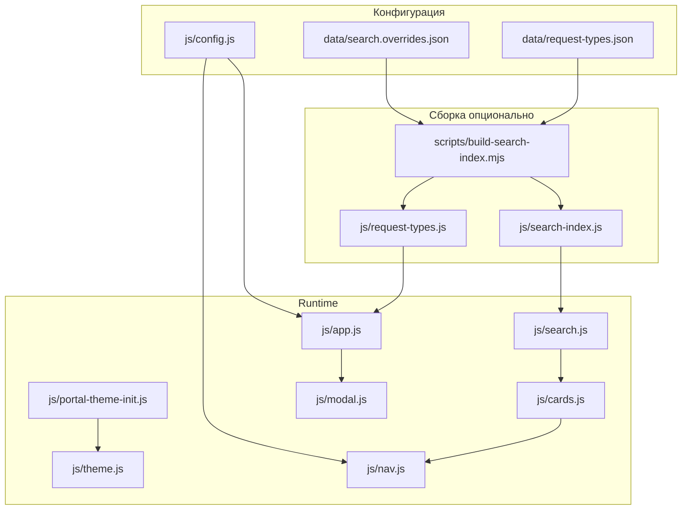
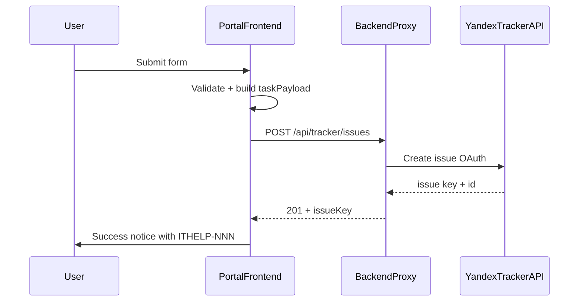

# План доработок ИТ-портала 21vek

Дополнительный документ к [README.md](../README.md). Описывает текущее состояние проекта, выявленные риски и рекомендуемые улучшения.

**Документ не заменяет README** — он служит чек-листом для команды ИТ и основой для планирования интеграции с Яндекс Трекером.

**Последнее обновление:** 2026-06-26 — Sprint 2: UX/a11y/архитектура (кроме SVG-иконок).

### Статус пунктов

| Метка | Значение |
|-------|----------|
| ✅ | Выполнено |
| ⏳ | Открыто / в backlog |


## Принципы отбора рекомендаций

- Без глобальной перестройки архитектуры (остаёмся на статическом сайте, vanilla JS, config-driven модели).
- Приоритет **стабильности** и **универсальности** (браузеры, устройства, доступность, сопровождаемость).
- Инкрементальные изменения: каждая рекомендация решает конкретную проблему, а не переписывает проект.

### Легенда приоритетов

| Приоритет | Значение |
|-----------|----------|
| **P0** | Блокер или критический риск стабильности — исправить до prod / до подключения Трекера |
| **P1** | Важно для сопровождаемости, UX или интеграции |
| **P2** | Улучшение качества, снижение технического долга |
| **P3** | Полировка, не блокирует работу |

### Методология анализа

Проведён code review статического портала: HTML, CSS, JavaScript, конфигурация, сборочные скрипты. Нагрузочное тестирование, pen-test и аудит инфраструктуры **не проводились** — соответствующие пункты вынесены в backlog при необходимости.

---

## Текущее состояние проекта

Портал — **статический SPA-подобный сайт** без npm-сборки фронтенда: [index.html](../index.html) + модули в [js/](../js/) + CSS по слоям в [css/](../css/).



### Порядок загрузки скриптов

**В `<head>` (до CSS):** `portal-theme-init.js`

**В конце `<body>`:**
```
config.js → modal.js → form.js → theme.js → nav.js → search-index.js → search.js → cards.js → request-types.js → app.js
```

### Сильные стороны

- **Разделение ответственности**: конфиг (`PortalConfig`), поиск, модалки, тема, навигация — отдельные модули.
- **Умный поиск**: синонимы, переключение раскладки RU/EN, overrides через [data/search.overrides.json](../data/search.overrides.json).
- **Модальные окна**: focus trap, Escape, восстановление фокуса, `aria-*` ([js/modal.js](../js/modal.js)).
- **Адаптивность**: safe-area insets, touch targets 44px, `prefers-reduced-motion`.
- **Демо-режим Трекера**: payload формируется корректно, отправка имитируется без секретов в репозитории.

- **Единый источник типов заявок**: [data/request-types.json](../data/request-types.json) → генерирует [js/request-types.js](../js/request-types.js); runtime читает `window.PortalRequestTypes`.
- **Валидация сборки**: `build-search-index.mjs` проверяет соответствие HTML-карточек и JSON типов.
- **Доступные карточки**: `<button type="button" class="service-card">` с `aria-label` — клавиатурная активация и focus-visible.
- **Ранний init темы**: [js/portal-theme-init.js](../js/portal-theme-init.js) предотвращает FOUC; тема по умолчанию — system.
- **npm-скрипты сборки**: `npm run build:search`, `npm run build:errors` ([package.json](../package.json)).
- **Документация контрактов**: [docs/ARCHITECTURE.md](ARCHITECTURE.md).
- **Skip-link, inline-поиск, scroll-to-top на mobile**, design tokens, a11y radio/alert/fallbacks — см. Sprint 2 ниже.

### Открытые риски

| # | Проблема | Риск | Статус |
|---|----------|------|--------|
| 1 | Интеграция Трекера — **заглушка**: `demoMode: true`, только `console.log`; при `demoMode: false` модалка закрывается **без HTTP-запроса** | Prod-режим не работает; пользователь думает, что заявка отправлена | ⏳ STAB-03, TRK-* |

### Недавно исправлено

| Дата | Что сделано |
|------|-------------|
| 2026-06-26 Sprint 0 | portal-theme-init, request-types.json, карточки как button, sidebar CSS |
| 2026-06-26 Sprint 2 | Skip-link, CSS utilities, inline search spinner, Ctrl+F hint, scroll-to-top mobile, FAQ «скоро», design tokens, system theme, a11y radio/alert/color-mix, package.json, ARCHITECTURE.md |

**Остаётся два источника контента услуг** (by design): разметка карточек в HTML (UI) + типы форм в JSON (логика). Связь контролируется сборкой — см. [docs/ARCHITECTURE.md](ARCHITECTURE.md).

---

## 2. Архитектура и сопровождаемость

✅ **Закрыто** (ARCH-01…ARCH-06): theme init, контракт услуг, валидация сборки, request-types.json, npm-скрипты, [docs/ARCHITECTURE.md](ARCHITECTURE.md).

---

## 3. UI/UX и дизайн-система

### UX-10 · P3 · SVG вместо emoji

**Проблема.** Иконки разделов, карточек и переключателя темы — emoji. Рендеринг различается по ОС; screen reader читает emoji непредсказуемо.

**Предложение.** Постепенно заменить на SVG (декоративные с `aria-hidden="true"`). [assets/logo-21vek.svg](../assets/logo-21vek.svg) уже есть — подключить в шапку.

**Файлы:** `index.html`, `assets/`, `css/style.css`, `js/config.js`.

---

## 4. Доступность (a11y)

✅ **Закрыто** (A11Y-01…A11Y-05): клавиатурные карточки, radio в формах, scroll-to-top tab order, `showGlobalError` вместо `alert()`, fallback для `color-mix`.

---

## 5. Стабильность и кросс-браузерность

### STAB-01 · ✅ Выполнено · 404 portal-theme-init.js

Исправлено в ARCH-01 / Sprint 0.

---

### STAB-02 · P1 · Защита от двойной отправки

**Проблема.** Кнопка «Отправить» не блокируется при submit; повторный клик до закрытия модалки возможен.

**Риск.** Дублирующие заявки в Трекере после интеграции.

**Предложение.** `submitBtn.disabled = true` на время запроса; debounce 2–3 сек.

**Файлы:** `js/app.js`.

---

### STAB-03 · P1 · HTTP-слой для заявок

**Проблема.** Нет `fetch`; prod-путь (`demoMode: false`) закрывает модалку без сетевого вызова.

**Риск.** Потеря заявок; ложное ощущение успеха.

**Предложение.** Единая функция `submitToTracker(payload)` — см. раздел 6.

**Файлы:** `js/app.js`, `js/config.js`.

---

### STAB-04 · P2 · Smoke-checklist браузеров

**Предложение.** Перед релизом проверять вручную:

- Chrome / Edge (desktop)
- Firefox (desktop)
- Safari iOS
- Chrome Android

Критичные сценарии: поиск, модалки, тема, отправка формы.

---

### STAB-05 · P2 · Конфиг окружений

**Проблема.** Internal URL в [js/config.js](../js/config.js): `snipeit-tb.triovist.local`, placeholder `phonebook.company.ru`.

**Риск.** Неверные ссылки при деплое в другую среду.

**Предложение.** Pattern `config.local.js` (в `.gitignore`) или документированные placeholder'ы с инструкцией замены при деплое.

**Файлы:** `js/config.js`, `.gitignore`, README.

---

## 6. Интеграция Яндекс Трекера

Ключевой раздел: что уже готово на фронтенде и что потребует доработки при подключении API.

### 6.1 Текущая подготовка

| Элемент | Расположение | Статус |
|---------|--------------|--------|
| Очередь | `trackerQueue: 'ITHELP'` в [js/config.js](../js/config.js) | Готово |
| Демо-режим | `demoMode: true` | Готово (dev) |
| Payload заявки | `submitTask()` в [js/app.js](../js/app.js) | Готово |
| Payload сброса пароля | обработчик `#passwordResetForm` | Готово |
| Маршрутизация типов | `data-request-type` ↔ `PortalRequestTypes` | Готово |
| Двухшаговый мастер | `twoStepRequestTypes: ['hr_new']` | Готово |
| HTTP / OAuth | — | **Не реализовано** |

#### Формат payload заявки

```javascript
{
  queue: 'ITHELP',           // из PortalConfig.trackerQueue
  summary: string,           // поле «Краткое описание»
  description: string,       // многострочный текст:
                             //   ФИО заявителя, категория, подкатегория, extra
  source: 'web-form',
  requestType: string        // ключ из PortalRequestTypes, напр. 'hr_new', 'tech_support'
}
```

#### Формат payload сброса пароля

```javascript
{
  target: string,      // ФИО, кому сбросить
  requester: string, // ФИО инициатора
  reason: string,
  source: 'web-reset'
}
```

#### Типы заявок (PortalRequestTypes)

18 типов в [data/request-types.json](../data/request-types.json): `tech_support`, `software_issues`, `equipment_issue`, `equipment_return`, `equipment_transfer`, `hr_new`, `hr_dismiss`, `hr_change`, `org_structure`, `vm_create`, `network_access`, `skud_access`, `skud_repair`, `camera_install`, `printer_setup`, `printer_repair`, `other_noform`, `universal_it`.

---

### 6.2 Зависимости фронтенда от бэкенда и Трекера

| Зона | Зависимость от бэкенда | Что менять на фронте |
|------|------------------------|----------------------|
| **API endpoint** | Прокси, напр. `POST /api/tracker/issues`; OAuth-токен только на сервере | Добавить `trackerApiUrl` в `PortalConfig`; `fetch` в `submitTask()` и password reset |
| **demoMode** | `false` в production | Loading / success / error UI вместо auto-close |
| **Маппинг полей** | Custom fields Tracker (component, priority, tags, тип задачи) | Расширить payload полем `fields: {}` или согласовать, что бэкенд парсит `description` |
| **Очереди** | Одна `ITHELP` или разные queue per `requestType` | Сейчас одна очередь; при необходимости — `trackerQueues: { hr_new: 'HR', ... }` в config |
| **Summary / description** | Лимиты Tracker API на длину полей | Валидация на фронте (textarea уже `maxLength=1000`; проверить лимит summary) |
| **Автор задачи** | SSO, email из заголовков прокси | Фронт **не хранит токены**; опционально поле email в форме или identity от reverse proxy |
| **Ответ API** | `{ issueKey: 'ITHELP-123', issueUrl: '...' }` | Показать номер задачи пользователю после успеха |
| **Ошибки** | 4xx/5xx, rate limit, validation errors | `PortalForm.showError`; **не закрывать** модалку |
| **Password reset** | Отдельный workflow (Tracker / AD / скрипт) | Отдельный endpoint или тот же с фильтром по `source: 'web-reset'` |
| **CORS** | Same-origin к прокси | **Не вызывать** `api.tracker.yandex.net` из браузера напрямую |
| **Поиск / навигация / темы** | Не зависят от Трекера | Без изменений |

---

### 6.3 Рекомендуемый план интеграции



#### Шаг 1 · P0 · HTTP-клиент и состояния UI

- Добавить в `PortalConfig`:
  ```javascript
  trackerApiUrl: '/api/tracker/issues',
  trackerResetApiUrl: '/api/tracker/password-reset', // или тот же URL
  demoMode: false
  ```
- В `submitTask()`: после сборки `taskPayload` — `fetch(trackerApiUrl, { method: 'POST', headers: { 'Content-Type': 'application/json' }, body: JSON.stringify(taskPayload) })`.
- UI-состояния кнопки submit: idle → loading (spinner + disabled) → success / error.

#### Шаг 2 · P0 · Не закрывать модалку без ответа сервера

Текущее поведение:
```javascript
setTimeout(() => closeTaskModal(), demoMode ? 2500 : 0);
```
Заменить на: close только после `response.ok` и показа success-notice с номером задачи.

#### Шаг 3 · P1 · Custom events для аналитики

```javascript
document.dispatchEvent(new CustomEvent('portal:task-submitted', { detail: { issueKey, requestType } }));
document.dispatchEvent(new CustomEvent('portal:task-failed', { detail: { error, requestType } }));
```

Позволяет подключить метрику без изменения core-логики.

#### Шаг 4 · P1 · Idempotency / anti double-submit

Связано с **STAB-02**: disable submit, optional client-side request id в payload для dedup на бэкенде.

#### Шаг 5 · P2 · Номер задачи и ссылка

После успеха показать: «Заявка ITHELP-123 создана» + ссылка на задачу в Tracker (URL шаблон в config: `trackerIssueUrlTemplate: 'https://tracker.yandex.ru/ITHELP-123'`).

#### Шаг 6 · P2 · Маппинг requestType → поля Tracker

На стороне **прокси** (рекомендуется): `requestType` → queue, component, priority, tags, тип задачи. Фронт передаёт `requestType` as-is; не дублировать бизнес-правила Tracker в JS.

#### Пример расширенного payload (согласовать с бэкендом)

```javascript
{
  queue: 'ITHELP',
  summary: 'Не работает принтер',
  description: '...',
  source: 'web-form',
  requestType: 'printer_repair',
  fields: {
    // опционально — если бэкенд ожидает structured data
    fio: 'Иванов И.И.',
    subcategory: 'Заправка картриджа',
    location: 'Офис Покровский'
  }
}
```

---

### 6.4 Что НЕ трогать при интеграции Трекера

- Поиск ([js/search.js](../js/search.js), [js/cards.js](../js/cards.js), search-index).
- Темы ([js/theme.js](../js/theme.js)).
- Навигация и scroll-spy ([js/nav.js](../js/nav.js)).
- Error pages ([errors/](../errors/)).
- Инфраструктура модалок ([js/modal.js](../js/modal.js)).
- Сборка search-index и request-types ([scripts/build-search-index.mjs](../scripts/build-search-index.mjs)).

---

## 7. Конфигурация и контент

### CFG-01 · P1 · Актуализировать URL

- `phonebook.company.ru` — placeholder; заменить на реальный URL справочника.
- `snipeit-tb.triovist.local` — internal; документировать для prod/stage.

**Файлы:** [js/config.js](../js/config.js).

### CFG-02 · P1 · Процесс обновления поиска и типов заявок

При изменении [data/search.overrides.json](../data/search.overrides.json) и/или [data/request-types.json](../data/request-types.json):

```bash
npm run build:search
# или: node scripts/build-search-index.mjs
```

Закоммитить обновлённые [js/search-index.js](../js/search-index.js) и [js/request-types.js](../js/request-types.js). Без пересборки синонимы и типы не попадут в runtime.

### CFG-03 · P3 · Логотип в шапке

[assets/logo-21vek.svg](../assets/logo-21vek.svg) существует, но не используется в [index.html](../index.html). Подключить рядом с заголовком «ИТ-портал 21Vek».

---

## 8. Тестирование и приёмка

Проект без test runner — ручные чек-листы.

### 8.1 Регрессия поиска

- [ ] Запрос ≥3 символов фильтрует карточки
- [ ] Синонимы работают (напр. «принтер» → карточки МФУ)
- [ ] Опечатка раскладки (напр. «ghbdtn» → «принтер»)
- [ ] Пустая выдача показывает empty state и кнопку сброса
- [ ] Escape сбрасывает поиск (модалка закрыта)
- [ ] Ctrl/Cmd+F фокусирует поле поиска
- [ ] Скрытые карточки скрывают пустые section-group

### 8.2 Формы заявок

- [ ] Все 18 типов открывают модалку с корректным заголовком и подкатегориями
- [ ] `hr_new`: двухшаговый мастер (шаг 1 → шаг 2 → отправка)
- [ ] `tech_support` / `software_issues`: поля местоположения и detailedText
- [ ] Валидация пустых обязательных полей
- [ ] Сброс пароля: три поля, валидация

### 8.3 Модалки и доступность

- [ ] Escape закрывает модалку
- [ ] Клик по backdrop закрывает
- [ ] Focus trap: Tab не выходит за пределы модалки
- [ ] После закрытия фокус возвращается на карточку
- [ ] Карточки услуг: Tab доходит до кнопки, Enter/Space открывает форму
- [ ] На mobile клавиатура не перекрывает поля критично

### 8.4 Тема

- [ ] Переключение light/dark
- [ ] Сохранение после перезагрузки
- [ ] Синхронизация между двумя вкладками
- [ ] `prefers-reduced-motion`: без анимации blobs и theme transition

### 8.5 После интеграции Трекера

- [ ] Happy path: форма → loading → success с номером ITHELP-NNN
- [ ] Ошибка сети: сообщение об ошибке, модалка открыта, данные сохранены
- [ ] Ошибка 4xx (validation): понятный текст от сервера
- [ ] Двойной клик submit не создаёт дубликат
- [ ] Password reset: отдельный flow работает
- [ ] `demoMode: true` по-прежнему логирует в console без HTTP

---

## 9. Сводный backlog

| ID | Статус | P | Область | Effort | Описание |
|----|--------|---|---------|--------|----------|
| STAB-02 | ⏳ | P1 | Стабильность | S | Anti double-submit |
| STAB-03 | ⏳ | P1 | Стабильность | M | HTTP-слой Трекера |
| CFG-01 | ⏳ | P1 | Конфиг | S | Real URLs |
| TRK-01 | ⏳ | P0 | Трекер | M | fetch + UI states |
| TRK-02 | ⏳ | P0 | Трекер | S | No auto-close без response |
| TRK-03 | ⏳ | P1 | Трекер | S | Custom events |
| TRK-04 | ⏳ | P2 | Трекер | S | Issue key + link |
| TRK-05 | ⏳ | P2 | Трекер | M | requestType mapping (backend) |
| STAB-04 | ⏳ | P2 | Стабильность | M | Browser smoke tests |
| STAB-05 | ⏳ | P2 | Стабильность | S | Environment URLs |
| UX-10 | ⏳ | P3 | UX | L | SVG icons |
| CFG-03 | ⏳ | P3 | Контент | S | Logo in header |

**Effort:** S = несколько часов, M = 0.5–1 день, L = несколько дней.

---

## 10. Группировка по спринтам

### Sprint 0 — стабильность ✅ (завершён 2026-06-26)

| ID | Статус |
|----|--------|
| ARCH-01 / STAB-01 | ✅ |
| UX-01 / A11Y-01 | ✅ |
| ARCH-02, ARCH-03, ARCH-04 | ✅ |
| UX-03 | ✅ |
| STAB-02 | ⏳ перенесён в Sprint 1 |

**Итог:** блокеры UX/a11y и drift типов заявок устранены. Остаётся anti double-submit перед prod.

### Sprint 1 — интеграция Яндекс Трекера (текущий)

| ID | Статус |
|----|--------|
| STAB-02 | ⏳ |
| STAB-03 | ⏳ |
| TRK-01, TRK-02 | ⏳ |
| TRK-03 | ⏳ |
| Раздел 8.5 (приёмка) | ⏳ |

**Цель:** рабочий prod-flow создания задач через backend proxy.

**Зависимости от backend-команды:**
- Endpoint(s) и контракт request/response
- OAuth / service account для Tracker API
- Маппинг `requestType` → поля Tracker
- CORS / same-origin policy

### Sprint 2 — UX и сопровождаемость ✅ (завершён 2026-06-26)

Skip-link, CSS utilities, inline search, Ctrl+F hint, scroll-to-top mobile, FAQ badges, design tokens, system theme, a11y radio/alert/fallbacks, package.json, ARCHITECTURE.md.

**Остаётся из UI/UX:** UX-10 (SVG вместо emoji).

### Backlog — P2/P3

STAB-04/05, TRK-04/05, UX-10, CFG-03.

---

## Связанные документы

- [README.md](../README.md) — описание продукта и инструкции для пользователей/администраторов
- [docs/ARCHITECTURE.md](ARCHITECTURE.md) — глобальные контракты и порядок загрузки модулей
- [errors/DEPLOY.md](../errors/DEPLOY.md) — настройка HTTP error pages на nginx/IIS/Apache
- [data/search.overrides.json](../data/search.overrides.json) — словарь поиска
- [data/request-types.json](../data/request-types.json) — типы заявок и подкатегории форм

---

*Документ подготовлен по результатам архитектурного и UX-анализа кодовой базы. Обновляйте статусы по мере выполнения пунктов backlog.*
